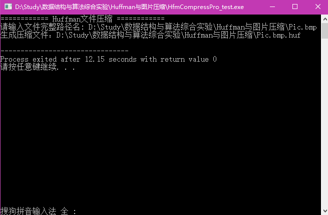
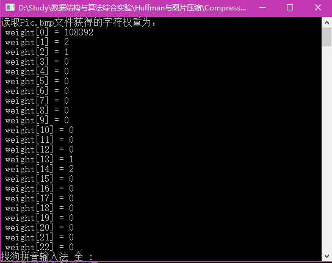
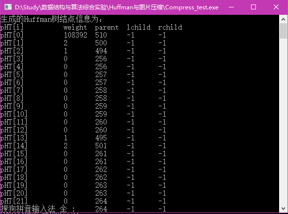
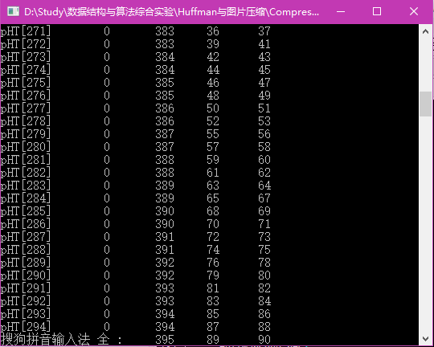
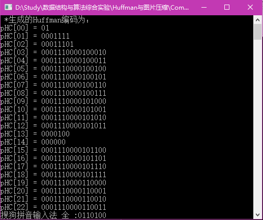
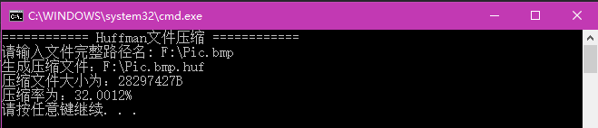

# Huffman压缩编码

——使用C++、文件操作和Huffman算法实现“图片压缩程序”。

@Author:Frank Liu

@email:frankliu624@outlook.com

@Blog:<https://flhonker.github.io>

@time: 2017-05

[TOC]


## 1. 核心知识

（1） 树的存储结构
（2） 二叉树的三种遍历方法
（3） Huffman树、Huffman编码算法

## 2. 功能要求

1.  针对一幅BMP格式的图片文件，统计256种不同字节的重复次数，以每种字节重复次数作为权值，构造一颗有256个叶子节点的哈夫曼二叉树。

2.  利用上述哈夫曼树产生的哈夫曼编码对图片文件进行压缩。

3.  压缩后的文件与原图片文件同名，加上后缀.huf（保留原后缀），如pic.bmp
    压缩后pic.bmp.huf

## 3.分析与设计

使用Huffman算法实现图片压缩程序，可分为6个步骤。

（1）创建工程

创建HuffmanCompressCPro工程，定义入口函数int main()；

（2）读取原文件

读取文件，统计256种字节重复的次数；

（3）生成Huffman树

根据上一步统计的结果，构建Huffman树；

（4）生成Huffman编码

遍历Huffman树，记录256个叶子节点的路径，生成Huffman编码；

（5）压缩编码

使用Huffman编码，对原文件中的字节重新编码，获得压缩后的文件数据；

（6）保存文件

将编码过的数据，保存到文件“Pic.bmp.huf”中。

## 4. 数据结构的设计

1.记录统计256种不同字节的重复次数即权值使用整型数组：

> unsigned int weight[256];

2.二叉树的存储结构。使用结构体存储节点，使用数组存储树的节点，使用静态二叉链表方式存储二叉树。
```c++
struct HTNode{ 
	int weight; 
	int parent; 
	int lchild; 
	int rchild; 
};
typedef HTNode *HuffmanTree;
```

3.Huffman编码存储结构定义一个二维数组:

> char HufCode[256][];

因考虑每个字节的Huffman编码长度不一样，可使用字符串指针数组:

> typedef char \*\*HuffmanCode;

4.压缩文件的算法的数据结构:

为正确解压文件，除了要保存原文件长度外，还要保存原文件中256种字节重复的次数，即权值。定义一个文件头，保存相关的信息：
```c++
struct HEAD { 
	char type[4];        //文件类型 
	int length;         //原文件的长度 
	char weight[256];    //权值 
}
```
压缩文件时，定义一个内存缓冲区：
> char \*pBuffer; //其大小视原文件压缩后的大小

## 5. 核心算法设计

**（1）构造Huffman树算法 **
```c++
void CreateHuffmanTree(HuffmanTree &pHT, int weight[])
{
	/* i、j：循环变量，m1、m2：构造哈夫曼树不同过程中两个最小权值结点的权值，
	x1、x2：构造哈夫曼树不同过程中两个最小权值结点在数组中的序号。*/
	int i, j, m1, m2, x1, x2;
	HuffmanTree p;
	pHT = (HuffmanTree)malloc(2 * nSIZE * sizeof(HTNode));
	for (p = pHT, i = 0; i < nSIZE; ++i, ++p)
		*p = { weight[i], -1, -1, -1 };
	for (; i < 2 * nSIZE - 1; ++i, ++p)
		*p = { 0, -1, -1, -1 };
	/* 循环构造 Huffman 树 */
	for (i = 0; i<nSIZE - 1; i++)
	{
		m1 = m2 = MAXVALUE;     /* m1、m2中存放两个无父结点且结点权值最小的两个结点 */
		x1 = x2 = 0;
		/* 找出所有结点中权值最小、无父结点的两个结点，并合并之为一颗二叉树 */
		for (j = 0; j<nSIZE + i; j++)
		{
			if (pHT[j].weight < m1 && pHT[j].parent == -1)
			{
				m2 = m1;
				x2 = x1;
				m1 = pHT[j].weight;
				x1 = j;
			}
			else if (pHT[j].weight < m2 && pHT[j].parent == -1)
			{
				m2 = pHT[j].weight;
				x2 = j;
			}
		}
		/* 设置找到的两个子结点 x1、x2 的父结点信息 */
		pHT[x1].parent = nSIZE + i;
		pHT[x2].parent = nSIZE + i;
		pHT[nSIZE + i].weight = pHT[x1].weight + pHT[x2].weight;
		pHT[nSIZE + i].lchild = x1;
		pHT[nSIZE + i].rchild = x2;
	}
}
```
**（2）生成Huffman编码算法 **
```c++
int HuffmanCoding(HuffmanCode &pHC, HuffmanTree &pHT)
{
	// 无栈非递归遍历Huffman树，求Huffman编码
	char cd[nSIZE] = { '\0' };// 记录访问路径
	int cdlen = 0;// 记录当前路径长度
	int i, c, p;
	for (i = 0; i < nSIZE; i++)
	{
		int start = 255;
		c = i;
		p = pHT[c].parent;
		while (p != -1)         /* 双亲结点存在 */
		{
			if (pHT[p].lchild == c)
				cd[--start] = '0';
			else
				cd[--start] = '1';
			c = p;
			p = pHT[c].parent;    /* 设置下一循环条件 */
		}
		//cd[cdlen] = '\0';

		/* 保存求出的每个叶结点的哈夫曼编码 */
		strcpy(pHC[i], &cd[start]);
		//pHC[i] = (char*)malloc((cdlen + 1) * sizeof(char));
		//pHC[i] = cd;
	}
	return OK;
}
```
**（3）压缩编码算法**
```c++
int Encode(const char *pFilename, const HuffmanCode pHC, char *pBuffer, const int nSize)
{
	// 开辟缓冲区
	pBuffer = (char *)malloc(nSize * sizeof(char));
	if (!pBuffer)
	{
		cerr << "开辟缓冲区失败!" << endl;
		return ERROR;
	}

	char cd[SIZE] = { ‘\0’ };  // 工作区
	int pos = 0;		// 缓冲区指针
	int ch;
	FILE *in = fopen(pFilename, "rb");
	// 扫描文件，根据Huffman编码表对其进行压缩，压缩结果暂存到缓冲区中。
	while ((ch = fgetc(in)) != EOF)
	{
		strcat(cd, pHC[ch]);	// 从pHC复制编码串到cd
								// 压缩编码
		while (strlen(cd) >= 8)
		{
			// 截取字符串左边的8个字符，编码成字节
			pBuffer[pos++] = Str2byte(cd);
			// 字符串整体左移8字节
			for (int i = 0; i < SIZE - 8; i++)
			{
				cd[i] = cd[i + 8];
			}
		}
	}
	if (strlen(cd) > 0)
	{
		pBuffer[pos++] = Str2byte(cd);
	}

}

int Compress(const char *pFilename, HuffmanCode &pHC, const HEAD sHead)
{
	//计算缓冲区的大小  
	int nbuf = 0;
	for (int i = 0; i<nSIZE; i++)
	{
		nbuf += sHead.weight[i] * sizeof(pHC[i]);
	}
	nbuf = (nbuf % 8) ? nbuf / 8 + 1 : nbuf / 8;
	//cout<<"nbuf = "<<nbuf<<endl; 
	char *pBuffer = NULL;
	Encode(pFilename, pHC, pBuffer, nbuf);
	if (!pBuffer)
		return ERROR;
	int result = WriteFile(pFilename, sHead, pBuffer, nbuf);
	return result;
}
```
**（4）生成压缩文件算法：**
```c++
int WriteFile(const char *pFilename, const HEAD sHead, char *pBuffer, const int nbuf)
{
	// 生成文件名
	char filename[nSIZE + 5] = { '\0' };
	strcpy(filename, pFilename);
	strcat(filename, ".huf");

	// 以二进制流形式打开文件
	FILE *fout = fopen(filename, "wb");
	// 写文件头
	fwrite(&sHead, sizeof(HEAD), 1, fout);
	// 写压缩后的编码
	fwrite(pBuffer, sizeof(char), nbuf, fout);
	//	cout<<"fwrite2 OK!"<<endl;
	// 关闭文件，释放文件指针
	fclose(fout);
	fout = NULL;

	cout << "生成压缩文件：" << filename << endl;
	int len = sizeof(HEAD) + strlen(pFilename) + 1 + nbuf;
	cout << "压缩文件大小为：" << len << "B" << endl;

	FILE *finhuf = fopen(filename, "rb");
	int ch, huflength = 0;
	// 扫描文件，获得权重
	while ((ch = fgetc(finhuf)) != EOF)
		huflength++;
	// 关闭文件
	fclose(finhuf);
	finhuf = NULL;
	float rate = huflength * 1.0 / sHead.length * 100;
	cout.setf(ios::fixed);
	cout << "压缩率为：" << setprecision(4) << rate << "%" << endl;

	return len;
}
```

## 6. 开发环境

* Windows10_x64
* Microsoft Visual Studio 2013以上开发环境

## 7. 调试说明

调试主要内容为编写程序的语法正确性与否，程序逻辑的正确性与否。调试手段主要采用了Microsoft Visual Studio 2015集成开发环境中“调试（D）”菜单中的调试方法或手段。即：F5：启动调试；F11：逐语句调试；F12：逐过程调试；F9：切换断点；ctrl+B：新建断点等。并且根据VS2015的文本编辑器智能语法提示修改已知错误，然后启用调试，待调试通过检查运行结果，最后用边界值等进行多方面测试，保证程序的健壮性。

1. 在读取图片文件统计0-255个字符的权值的过程中，一开始采用了C\++的ifstream fin(“Pic.bmp”)文件流，然后通过while(fin>>ch){ cout<<ch;}测试输出文件字符码，就出现了无限循环，一直连续不断地输出6位十六进制的数。当时认为是文件流读取方式的原因，加了iOS::binary来控制采用二进制形式，还是没有解决。改用C语言的FILE *fp = fope( )终于可以正常读取输出文件字符码，但是还是没有找出C\++读取失败的原因。

2. 文件编码压缩Encode（）函数会产生编码后的一个缓冲区char *pBuffer；写文件函数会使用它直接写磁盘文件。调试过程中并没发现任何问题，就是不能成功地写后缀为.huf的文件。在相关函数中设置断点，观察缓冲区的情况，且编写屏幕输出缓冲区数据的程序段，发现缓冲区是空的。通过在Encode函数中以及 WriteFile函数中做同样的跟踪调试，发现在Encode函数中建立的缓冲区数据并没有带出来，通过分析发现是缓冲区空间构建位置的问题，即不能直接用这个变量做Encode（）函数形参，而应该采用指针或者引用类型做函数形参，这样可以通过直接访问pBuffer的内存地址改变缓冲区内容。

3. 编译时没有错误，通过 pHC[i] = (char*)malloc((cdlen + 1) * sizeof(char)); 获取内存空间，然后pHC[i] = cd; 将字符串数组cd的内容复制到pHC[i]中时出现了内存错误。编译后无错误，运行时出现错误一般是指针使用是内存分配出现错误。打开调试界面查看CPU状态，看到汇编代码，但是汇编功底不是很深，还是没有找到底层原因。只好换了一种实现方式：strcpy(pHC[i], &cd[start]); 问题得以解决。

4. 编译时总是提示fopen，strcpy，strcat等函数存在不安全问题，采用了3中方法中一种屏蔽了该报错。即在文件开头添加：
> \#pragma warning(disable:4996)

5. 在Dev-cpp里面调试时完全没有问题，移植到VC2015里，编译通过，就是执行时fwrite（）函数处发生中断。数据格式没有问题，指针也没有错误使用，提示信息显示访问冲突，可是所有的文件流用完都关闭了。最终通过异常处理得到了解决。

## 8. 测试效果

使用屏幕截图编辑成bmp图片文件pic.bmp测试哈夫曼压缩程序效果截图如下
各图。图1为输入文件名压缩成功界面；图2为读取Pic.bmp产生的部分不同权值字节信息；图3、4为Pic.bmp生成的HuffmanTree结点信息；图5为生成的Huffman编码信息；图6为Pic.bmp压缩大小及压缩率。

图1：输入文件名压缩成功界面



图2：读取Pic.bmp产生的部分不同权值字节信息



图3、4：Pic.bmp生成的HuffmanTree结点信息




图5:生成的Huffman编码信息



图6：Pic.bmp压缩大小及压缩率



## 9. 综合分析和结论

（1）在Huffman编码的过程中，对字符按概率有大到小的顺序重新排列，应使合并后的新符号尽可能排在靠前的位置，这样可使合并后的新符号重复编码次数减少，使短码得到充分利用。

（2）Huffman编码效率相当高，对编码器的要求也简单得多。

（3）Huffman它保证了出现概率大的符号对应于短码，概率小的符号对应于长码，每次字符的最后两个码字总是最后一位码元不同，前面的各位码元都相同，每次字符的最长两个码字有相同的码长。

（4）Huffman的编法并不一定是唯一的。

（5）通过上述测试用例的效果截图，可以看出：使用Huffman编码对格式为bmp的图片文件的压缩比在50%左右，但对WinRAR软件已经压缩的图片文件或文本文件的压缩情况不佳。

